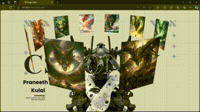

  <h1 align="center">3D Image Slider with CSS Only</h1>  
      

## Introduction

In the realm of modern web design, interactive elements play a crucial role in enhancing user experience and engagement. Among these elements, image sliders stand out as a popular choice. They allow websites to showcase multiple images or content pieces within a compact space. While JavaScript is often the go-to solution for creating sliders, advancements in CSS have made it possible to create stunning, interactive 3D image sliders without relying on JavaScript. In this article, we will explore how to create a 3D image slider using CSS only, providing a seamless, lightweight solution for your web projects.

## Table of Contents

- [Introduction](#introduction)
- [Why Use CSS Only?](#why-use-css-only)
- [Getting Started: Basic Structure](#getting-started-basic-structure)
- [Styling the Slider](#styling-the-slider)
- [Conclusion](#conclusion)
- [Live Demo](#live-demo)

## Why Use CSS Only?

### Performance Benefits

One of the primary reasons to opt for a CSS-only solution is performance. JavaScript, while powerful, can sometimes slow down the loading time of a website, especially if the scripts are not optimized. CSS, on the other hand, is lightweight and processed faster by browsers. By using CSS only, you can ensure your image slider loads quickly, providing a smooth experience for users.

### Simplicity and Maintainability

CSS-only sliders are simpler to implement and maintain compared to their JavaScript counterparts. There is no need to debug complex scripts or worry about cross-browser compatibility issues related to JavaScript. CSS provides a straightforward, declarative approach to styling and animations, making your code easier to read and maintain.

### Improved SEO

Since CSS is a styling language, it doesn’t interfere with the content of your page. This means search engines can crawl your site more effectively, improving your SEO. By keeping your slider's functionality within CSS, you avoid potential issues that JavaScript might cause with content visibility to search engines.

## Getting Started: Basic Structure

To create a 3D image slider with CSS only, we start with the basic HTML structure. The essential elements include a container for the slider, individual slides, and navigation controls. Here’s a breakdown of the structure:

- **Slider Container:** This will house the entire slider and provide the necessary perspective for the 3D effect.
- **Slides:** Each image or content piece will be placed within a slide.

## Styling the Slider

The first step in styling is to set up the container. This involves setting the perspective to create the 3D effect and defining the size of the slider. Each slide needs to be styled to fit within the slider container and rotated to achieve the 3D effect. To achieve the 3D effect, we need to rotate each slide along the Y-axis. The exact rotation angle will depend on the number of slides.

## Conclusion

Creating a 3D image slider with CSS only is not only possible but also efficient and elegant. By leveraging the power of CSS, you can create a visually appealing, interactive element that enhances your website's user experience without the overhead of JavaScript. This approach ensures better performance, easier maintenance, and improved SEO. As web technologies continue to evolve, embracing such CSS capabilities will keep your web design skills sharp and your projects at the cutting edge.

In this article, we've covered the basics of setting up a 3D image slider, styling it with CSS, and adding interactivity and advanced effects. With these techniques, you can create stunning sliders that captivate your audience and provide a memorable browsing experience.

Remember, the key to mastering CSS-only solutions lies in understanding the fundamentals of CSS and experimenting with different properties to achieve the desired effect. Happy coding!

## Live Demo

Check out the live demo of the 3D image slider [here](pkulal.github.io/3D-Image-Slider/).

Thank you for visiting my project!

---

*This README was generated with ❤️ by Praneeth Purushothama Kulal*
